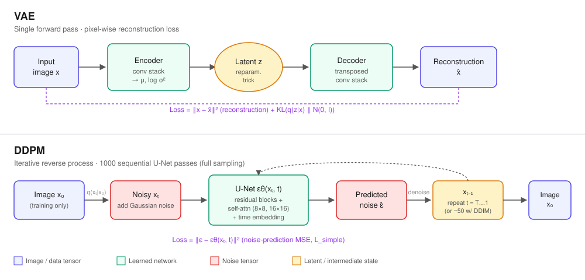
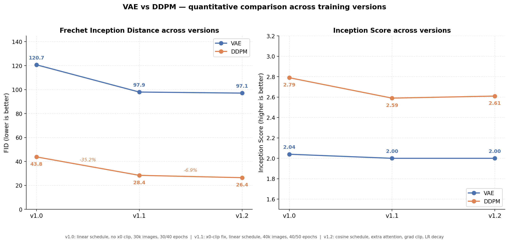
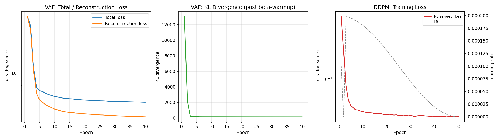
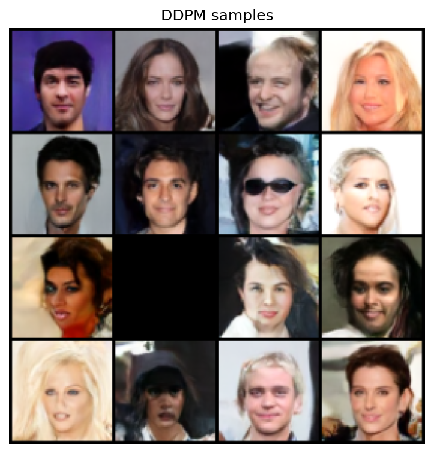
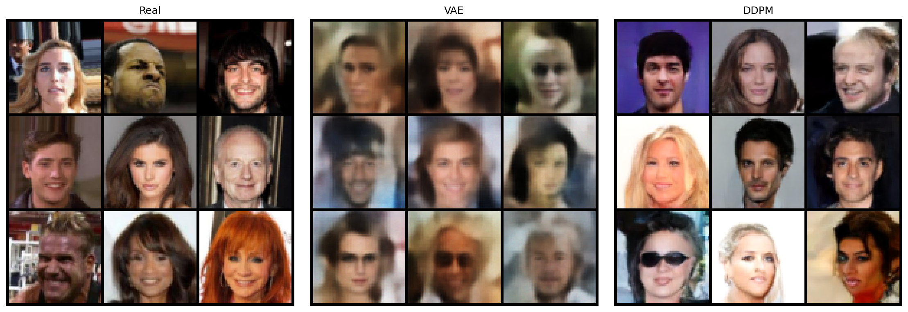
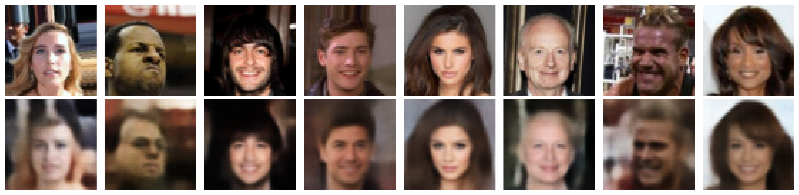
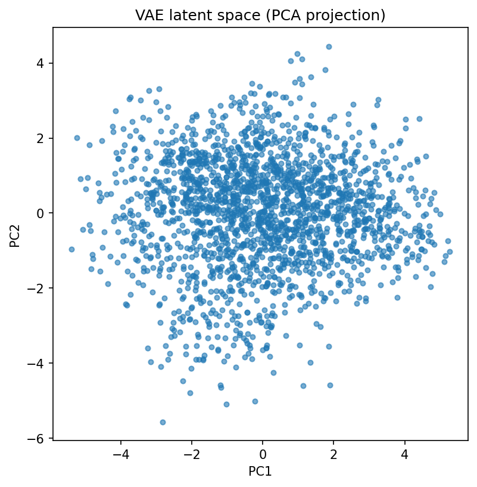
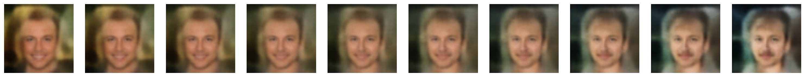
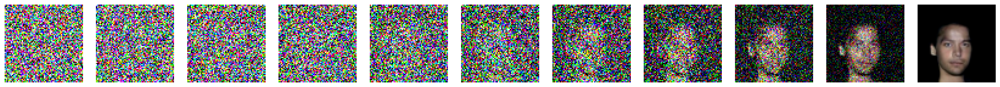
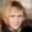

# VAE vs. DDPM: A From-Scratch Comparison on CelebA


A from-scratch PyTorch implementation and head-to-head benchmark of two generative model families — a **Variational Autoencoder (VAE)** and a **Denoising Diffusion Probabilistic Model (DDPM)** — trained on CelebA faces. Both models are built from base `torch.nn` primitives only, with no pretrained VAE and no `diffusers` dependency. The two approaches are compared quantitatively (FID, Inception Score, reconstruction PSNR) and qualitatively (diversity, realism, thematic consistency) across three iterated training versions.

## Table of Contents

- [Overview](#overview)
- [Features](#features)
- [Architecture Overview](#architecture-overview)
- [Project Structure](#project-structure)
- [Requirements](#requirements)
- [Installation](#installation)
- [Dataset](#dataset)
- [Configuration](#configuration)
- [Usage](#usage)
  - [Get Pretrained Weights](#get-pretrained-weights)
  - [Training](#training)
  - [Evaluation](#evaluation)
  - [Sampling](#sampling)
  - [Inference](#inference)
  - [Kaggle](#kaggle)
- [Results](#results)
  - [Quantitative Results](#quantitative-results)
  - [Qualitative Results](#qualitative-results)
- [Roadmap](#roadmap)
- [Contributing](#contributing)
- [License](#license)

---

## Overview

Generative image models are commonly evaluated in isolation, which makes it hard to reason about the practical trade-offs between architectures. This project implements both a VAE and a DDPM from first principles on the same dataset, same preprocessing pipeline, and same evaluation harness, so that differences in output quality can be attributed to the architecture itself rather than to pipeline inconsistencies.

The implementation spans three iterated training versions (v1.0 → v1.2). Each version is documented and benchmarked independently, making the improvement trajectory — not just the final result — part of the reproducible record. A critical DDPM sampling bug discovered and fixed between v1.0 and v1.1 is documented in detail, including its quantitative and visual impact.

## Features

- **Two generative architectures from scratch**: convolutional VAE and U-Net-based DDPM, no pretrained components.
- **Shared evaluation harness**: FID, Inception Score, and reconstruction PSNR computed identically for both models.
- **Dual sampling strategies for DDPM**: full ancestral sampling (1000 steps) and fast DDIM sampling (~50 steps).
- **Versioned experiments**: three fully documented training iterations (v1.0, v1.1, v1.2) with isolated configuration diffs.
- **Qualitative diagnostics**: latent-space PCA projection, latent interpolation, reconstruction grids, and denoising trajectory visualizations.
- **Reproducible pipeline**: deterministic seeding, `pytest` sanity suite, and a single orchestration layer (`src/engine/`) with no duplicated logic.
- **Kaggle-ready**: a notebook entry point that provisions the exact repository file tree and runs training/evaluation end to end.

## Architecture Overview



| | VAE | DDPM |
|---|---|---|
| **Core idea** | Encode to a low-dimensional Gaussian latent, decode back | Learn to reverse a fixed Markov noising process |
| **Objective** | Reconstruction (MSE) + KL divergence to N(0, I) | Noise-prediction MSE (`L_simple`, Ho et al., 2020) |
| **Generation cost** | 1 decoder forward pass | 1000 sequential U-Net forward passes (full DDPM) |
| **Building blocks** | Convolutional encoder/decoder (`src/models/encoder.py`, `decoder.py`) | U-Net with residual blocks, self-attention at 8×8 and 16×16, and sinusoidal time embeddings |
| **Sampling options** | Latent prior sampling | Full DDPM (1000 steps) or fast DDIM (~50 steps, minor quality trade-off) |

> **Note:** The VAE's pixel-wise reconstruction loss inherently biases output toward blur, while the DDPM's iterative denoising process trades sampling cost for sharper, higher-fidelity output. This trade-off is the central subject of the [Results](#results) section.

## Project Structure

```
vae-vs-ddpm-celeba/
├── .github/
│   └── workflows/
│       └── ci.yml
│ 
├── train.py               # Entry point: train VAE and DDPM
├── evaluate.py            # Entry point: compute metrics and visualizations
├── sample.py              # Entry point: generate samples from a trained model
├── inference.py           # Entry point: reconstruction / generation on custom input
├── configs/               # Dataset, model, diffusion, and training configuration
├── src/
│   ├── datasets/          # Dataset loading, transforms, and preprocessing
│   ├── models/            # Encoder, decoder, VAE, U-Net, attention, noise schedule
│   ├── losses/            # VAE loss, diffusion loss, optional perceptual (VGG) loss
│   ├── training/          # Trainers, optimizer/scheduler, callbacks, EMA
│   ├── sampling/          # DDPM and DDIM samplers, latent and image samplers
│   ├── evaluation/        # FID, Inception Score, reconstruction metrics
│   ├── visualization/     # Sample grids, curves, latent space, denoising strip
│   ├── utils/             # Seeding, device, logging, checkpointing
│   └── engine/            # Orchestration layer (Trainer/Evaluator/Inferencer)
├── scripts/               # Utility scripts (e.g. comparison chart regeneration)
├── notebooks/             # Kaggle entry point notebook
├── tests/                 # Pytest sanity suite
└── outputs/               # Checkpoints, logs, and results (v1.0, v1.1, v1.2, comparison)
    ├── logs/              # Raw per-epoch training logs (vae.log, ddpm.log)
    └── comparison/        # Version comparison and training curve charts
```

> **Design note:** `src/engine/` does not duplicate `training/` or `evaluation/` logic — it only wires them together. Each unit of logic lives in exactly one place.

## Requirements

- Python 3.10+
- PyTorch 2.x
- A CUDA-capable GPU is strongly recommended. DDPM sampling requires 1000 sequential U-Net forward passes per image and is impractically slow on CPU.
- Full Python dependencies are listed in `requirements.txt`.

## Installation

```bash
git clone https://github.com/AhmedAbdAlkreem/vae-vs-ddpm-celeba
cd vae-vs-ddpm-celeba
pip install -r requirements.txt
```

Verify the installation before training:

```bash
pytest
```

This validates every model, loss function, and sampler in well under a minute, catching a broken environment before any training time is spent.

## Dataset

This project uses the [CelebFaces Attributes (CelebA) Dataset](https://www.kaggle.com/datasets/jessicali9530/celeba-dataset) at 64×64 resolution, aligned and cropped.

CelebA was chosen because it is large enough for a meaningful benchmark, simple enough (aligned, centered faces) for both architectures to converge within a modest GPU budget, and because the VAE-vs-DDPM blur/sharpness trade-off is visually obvious on faces — making the qualitative comparison legible rather than only a number in a table.

**Download options:**

```bash
# Option A: Kaggle API (requires a Kaggle account and API token at ~/.kaggle/kaggle.json)
pip install kaggle
kaggle datasets download -d jessicali9530/celeba-dataset
```

Extract the downloaded archive:

```bash
# Linux / macOS / WSL / Git Bash
unzip celeba-dataset.zip -d celeba-dataset
```

```powershell
# Windows (PowerShell)
Expand-Archive -Path celeba-dataset.zip -DestinationPath celeba-dataset
```

Option B: download manually from the [dataset page](https://www.kaggle.com/datasets/jessicali9530/celeba-dataset) and extract it using your OS's built-in archive tool.

Note the full path to the folder containing the `.jpg` files (e.g. `.../celeba-dataset/img_align_celeba/img_align_celeba`) — it is required in the configuration step below.

## Configuration

All hyperparameters are centralized under `configs/` and combined through `configs/config.py`. Point the dataset path to your local CelebA directory before running any entry point:

```python
from configs.config import Config

cfg = Config()
cfg.dataset.data_dir = "/full/path/to/celeba-dataset/img_align_celeba/img_align_celeba"
cfg.output_dir = "outputs"
```

| Config module | Responsibility |
|---|---|
| `configs/dataset.py` | Dataset paths, image size, augmentations |
| `configs/model.py` | VAE and U-Net hyperparameters |
| `configs/diffusion.py` | Noise schedule, timesteps, sampler choice (`ddpm` / `ddim`) |
| `configs/training.py` | Epochs, batch size, learning rate, `use_perceptual_loss` flag |

## Usage

### Get Pretrained Weights

**Required** for Evaluation, Sampling, and Inference below — skip this only if you plan to run Training yourself first. Model weights exceed GitHub's file-size limits and are hosted on [Hugging Face Hub](https://huggingface.co/UseItOrLoseIt/vae-vs-ddpm-celeba) instead.

**Method 1 — Hugging Face CLI (recommended):**

```bash
pip install -U huggingface_hub
hf download UseItOrLoseIt/vae-vs-ddpm-celeba vae_best.pt --local-dir outputs/checkpoints
hf download UseItOrLoseIt/vae-vs-ddpm-celeba ddpm_best.pt --local-dir outputs/checkpoints
```

**Method 2 — direct download (if the CLI is unavailable):**

```bash
mkdir -p outputs/checkpoints
curl -L -o outputs/checkpoints/vae_best.pt https://huggingface.co/UseItOrLoseIt/vae-vs-ddpm-celeba/resolve/main/vae_best.pt
curl -L -o outputs/checkpoints/ddpm_best.pt https://huggingface.co/UseItOrLoseIt/vae-vs-ddpm-celeba/resolve/main/ddpm_best.pt
```

Verify the download succeeded — expected sizes are **~34.7 MB** for `vae_best.pt` and **~107 MB** for `ddpm_best.pt`:

```bash
ls -lh outputs/checkpoints/
```

### Training

```bash
python train.py
```

Trains the VAE followed by the DDPM. Training resumes automatically from the last checkpoint if interrupted.

### Evaluation

```bash
python evaluate.py
```

Computes FID, Inception Score, and reconstruction PSNR for both models, and regenerates all diagnostic visualizations (latent PCA, interpolation, denoising trajectory).

### Sampling

```bash
python sample.py --model ddpm --n 16
```

Generates new samples from a trained model. `--model` accepts `vae` or `ddpm`; `--n` sets the number of samples.

### Inference

```bash
python inference.py --reconstruct path/to/your_photo.jpg
python inference.py --generate ddpm
python inference.py --generate vae
```

`--reconstruct` encodes and decodes a custom image through the VAE. `--generate` produces a new sample from the specified model.

### Kaggle

1. Create a new Notebook, then set **Settings → Accelerator → GPU** (T4 x2 or P100).
2. Click **Add Input**, search for **CelebFaces Attributes (CelebA) Dataset**, and add it.
3. Open `notebooks/kaggle_run.ipynb` and run its cells in order — they write the full repository file tree via `%%writefile`, then execute `train.py` and `evaluate.py`.
4. If the dataset mounts at a non-standard path, add the exact path to `CELEBA_DIR_CANDIDATES` in `src/datasets/preprocessing.py` if `train.py` raises `FileNotFoundError`.

## Results

Three full training versions were completed, each documented in [CHANGELOG.md](CHANGELOG.md). Results are compared across all three versions rather than showing only the final numbers, since the improvement trajectory is itself part of the technical record.

### Quantitative Results



| | v1.0 | v1.1 | v1.2 |
|---|---|---|---|
| Dataset subset | 30,000 images | 40,000 images | 40,000 images |
| VAE / DDPM epochs | 30 / 40 | 40 / 50 | 40 / 50 |
| Beta schedule | linear | linear | **cosine** |
| DDPM sampler | ancestral, no x0 clipping | ancestral, x0 clipped | ancestral, x0 clipped |
| U-Net attention | 8×8 only | 8×8 only | 8×8 + 16×16 |
| Gradient clipping / LR decay | none | none | yes / yes |
| VAE FID ↓ | 120.69 | 97.94 | **96.84** |
| VAE Inception Score | 2.04 ± 0.06 | 2.00 ± 0.08 | 1.98 ± 0.05 |
| VAE reconstruction PSNR ↑ | 22.27 dB | 22.48 dB | 22.47 dB |
| **DDPM FID ↓** | 43.77 | 28.37 | **26.42** |
| DDPM Inception Score | 2.79 ± 0.12 | 2.59 ± 0.13 | 2.61 ± 0.17 |

*v1.2 figures computed over 2,000 evaluation samples; see `results.json`.*

### Training Curves



Generated with `src/visualization/training_curves.py`, which parses the raw epoch-level training logs (`outputs/logs/vae.log`, `outputs/logs/ddpm.log`) and is resume-safe — both models were interrupted and resumed once during v1.2 training, and the script deduplicates by epoch number rather than assuming a single contiguous run.

- **VAE:** reconstruction loss decreases monotonically from 5,080 to 282 over 40 epochs with no divergence or oscillation. KL divergence rises during the 6-epoch beta-warmup (`kl_w`: 0 → 1.0) as expected, then decreases smoothly once the full KL weight is applied — consistent with a stable, non-collapsed posterior rather than a warmup artifact.
- **DDPM:** noise-prediction loss drops sharply over the first ~20 epochs (0.66 → 0.034) and then plateaus around 0.032–0.033 for the remainder of training, tracking the cosine learning-rate decay to zero. The flat tail indicates the model reached convergence within the 50-epoch budget rather than being cut off mid-training.

**Overall change, v1.0 → v1.2: VAE FID −19.8%, DDPM FID −39.6%.**

- **v1.0 → v1.1 (largest single jump):** fixed a sampling bug in which the ancestral DDPM sampler never clipped its intermediate predicted-x0 estimate back to the valid `[-1, 1]` pixel range. Over 1000 steps, this numerical drift compounded; an unclipped run was verified to produce pixel values from **−6.06 to 6.72**, manifesting as solid black/white panels in place of faces. This fix was combined with a larger training budget in the same version, so the FID gain reflects both factors together.
- **v1.1 → v1.2 (smaller, incremental gain):** with the sampling bug already resolved, this iteration tested architectural refinements on a working baseline — cosine beta schedule, attention at an additional resolution, gradient clipping, and cosine LR decay. Smaller gains here match the expected pattern: large one-time wins from bug fixes, smaller incremental wins from tuning. None of the v1.2 changes affected the VAE, which explains its flat metrics.

> **Note:** Inception Score is a secondary signal throughout, derived from a 1000-class ImageNet classifier that does not include a face class — FID is the more informative metric for this task.

### Qualitative Results

The quantitative metrics establish *that* DDPM improved; this section shows *what that improvement looked like* in practice.

**v1.0 — first full training run, sampler bug present:**



Two of these sixteen DDPM samples are not faces at all — a near-blank white panel and a near-solid black panel — the direct visual fingerprint of the numerical drift bug described above.

**v1.2 — current best, sampler fixed, architecture refined:**



No blank or corrupted panels remain. Every DDPM sample is a coherent face, with several difficult to distinguish from the real reference images. This side-by-side is the clearest evidence that the v1.1 bug fix and v1.2 refinements produced a measurable, visible improvement.

**Diversity.** Both models produce varied output across age, hair color, gender presentation, and expression, with no visible mode collapse. DDPM's v1.2 diversity is now fully usable, since none of the sampled faces fail outright (unlike v1.0).

**Realism.** The architectural difference remains visible even after DDPM's improvements. Every VAE face shares a soft, out-of-focus quality — hair blending into background, lack of sharp edges, slightly washed-out color — a direct consequence of the pixel-wise reconstruction loss the VAE optimizes, not a training deficiency. The v1.2 DDPM faces show photographic-level sharpness — individual hair strands, defined eye catchlights, natural skin texture — with none of the v1.0 artifacts.

**Thematic consistency.** Every VAE sample across every version has been a recognizable face. DDPM v1.0 was roughly 14/16 (2 outright failures); the v1.2 comparison grid shows **0 visible failures** among the 9 DDPM samples shown — a direct "does this look broken" check, arguably more convincing than the FID improvement alone.

**Internal representations (v1.2):**

| Visualization | What it shows | Evidence provided |
|---|---|---|
|  | Real image (top) vs. VAE reconstruction (bottom) | Identity-relevant structure (hair color, pose, geometry) is preserved while fine detail is lost — the direct visual meaning of the 22.47 dB reconstruction PSNR |
|  | PCA projection of 2,000 encoded latent vectors | A dense, roughly Gaussian cloud with no isolated clusters — confirms the encoder is not exhibiting posterior collapse |
|  | Decoded interpolation between two random latent vectors | Smooth, gradual transitions with no abrupt jumps — evidence of a continuous, semantically meaningful latent space |
|  | Intermediate snapshots from pure noise to final output | A face silhouette emerges only in the final third of the 1000-step trajectory, sharpening rapidly near the end |

**Summary.** The v1.0 → v1.2 trajectory is visible qualitatively as well as numerically: a model that produced outright broken output roughly one in eight times now produces consistently coherent, often sharp results, while the VAE's characteristic blur — an architectural trait rather than a bug — remains stable across all three versions.

**Final numbers (v1.2, current best):**

| Model | FID ↓ | Inception Score ↑ | Reconstruction PSNR ↑ | Sampling cost |
|---|---|---|---|---|
| VAE | 96.84 | 1.98 ± 0.05 | 22.47 dB | 1 forward pass |
| DDPM | 26.42 | 2.61 ± 0.17 | n/a | 1000 forward passes (full DDPM) |

### Original vs. reconstruction vs. generation

[#original-vs-reconstruction-vs-generation](#original-vs-reconstruction-vs-generation)

The clearest way to see what each model is actually doing: take a real face,
reconstruct it through the VAE, and compare that against each model
generating a face from scratch (no input image, just noise).

| Original | VAE reconstruction | VAE generated | DDPM generated |
|:---:|:---:|:---:|:---:|
|  |  |  |  |

- **Original -> VAE reconstruction**: identity-relevant structure (hair
color, pose, face geometry) survives the encode-decode round trip, but fine
detail is lost — the direct visual meaning of the 22.47 dB reconstruction
PSNR reported above.
- **VAE generated**: sampling a fresh latent from `N(0,I)` and decoding
produces a plausible but visibly soft face — same architecture-bound blur
as the reconstruction, since generation and reconstruction share the same
decoder.
- **DDPM generated**: starting from pure noise and reversing through 1000
steps produces the sharpest result of the three — hair strands, eye
catchlights, and skin texture all render with photographic detail that
neither VAE output achieves.

## Roadmap

- **Enable perceptual loss for the VAE** — the highest-leverage next step for reducing VAE blur; already implemented via `configs/training.py`'s `use_perceptual_loss` flag but unused in any reported version.
- **Benchmark the DDIM sampler** — implemented but not yet evaluated; no results generated with `cfg.diffusion.sampler = "ddim"`.
- **Scale up training budget** — current results use a modest subset and epoch count relative to published DDPM benchmarks on full CelebA (~200k images, hundreds of epochs); current numbers are credible at this budget, not a ceiling.

See [CHANGELOG.md](CHANGELOG.md) for the complete version-by-version technical history, including every bug found and fixed.

## Contributing

Contributions are welcome. Please open an issue to discuss significant changes before submitting a pull request. Ensure `pytest` passes locally before submitting, and keep new functionality covered by tests where applicable.

## License

Released under the [MIT License](LICENSE).
